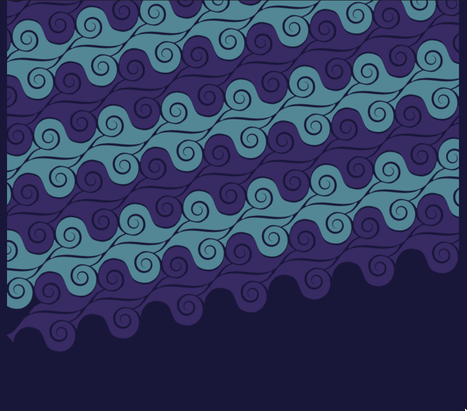
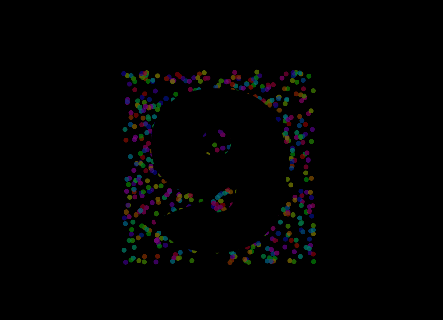
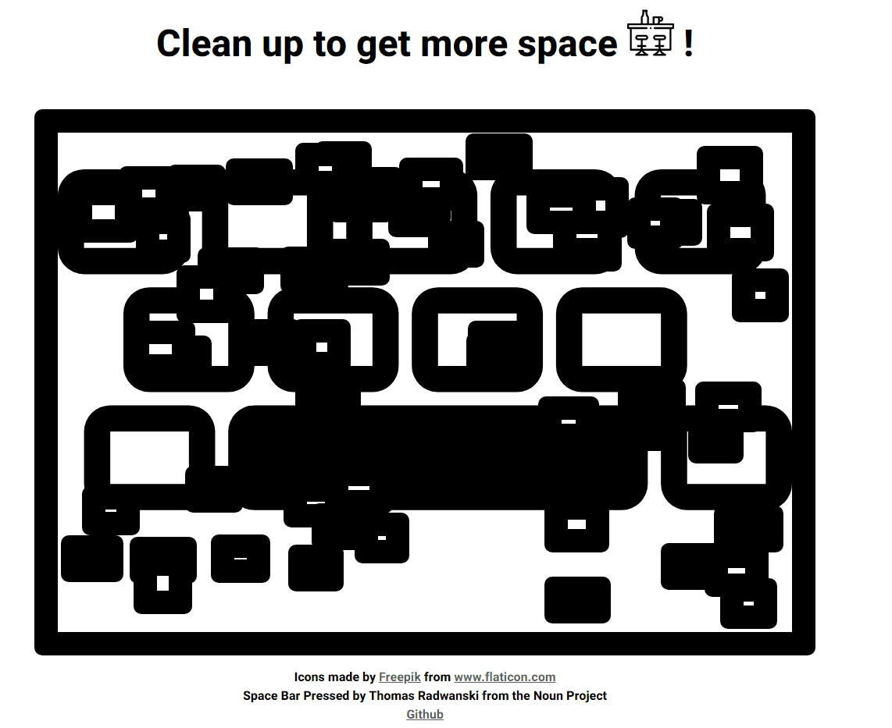

# CodePen challenges

I have joined the CodePen weekly challenges and I am having a lot of fun. Check it [here](https://codepen.io/panvicka). Some of my pens were picked by CodePen, check them! 

- [Keep Snailing (Tessellation Challenge)](https://codepen.io/panvicka/full/KKmvQmw)
   
   <a href="https://codepen.io/panvicka/full/KKmvQmw">   <a>

- [Sheep generator](https://codepen.io/panvicka/pen/MWeXVrM)

   <a href="https://codepen.io/panvicka/pen/MWeXVrM">   <a>

- [New Years Countdown](https://codepen.io/panvicka/pen/abmmGJZ)

  <a href="https://codepen.io/panvicka/pen/abmmGJZ">   <a>

- [Get more space!](https://codepen.io/panvicka/pen/pobqvyL)

  <a href="https://codepen.io/panvicka/pen/pobqvyL">   <a>