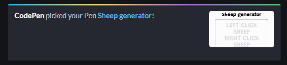
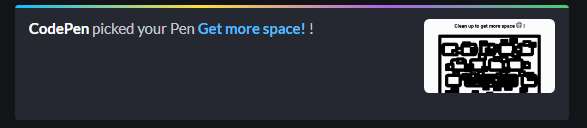
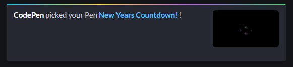

# CodePen challenges

I have joined the CodePen weekly challenges and I am having a lot of fun. I am always trying to think outside of the box and come with something original, interactive and fun! Also to improve my JS, Typescript and CSS skils.
The repo has some opened issues and features ideas, so feel free to contribute if you feel like it. 

## 2020 November Challenges - The principles of Design

### Week 1: Contrast - Generate some sheep for yourself
- [CodePen demo](https://codepen.io/panvicka/pen/MWeXVrM)
- [Project folder](2020Nov_Contrast/README.md)

 

### Week 2: Spacing - Clean up and discover (not) hidden joke
- [CodePen demo](https://codepen.io/panvicka/pen/pobqvyL)
- [Project folder](2020Nov_Spacing/README.md)

 

### Week 3: Repetition - Check out programmer life! 
- [CodePen demo](https://codepen.io/panvicka/full/eYzwxXK)
- [Project folder](2020Nov_Repetition/README.md)

### Week 4: Unity - Make stick man happy
- [CodePen demo](https://codepen.io/panvicka/pen/ExgYJmx)
- [Project folder](2020Nov_Unity/README.md)

## 2020 December Challenges - It's the Holidays!

### Week 1: Calendars and Countdowns - New Years Countdown
- [CodePen demo](https://codepen.io/panvicka/pen/abmmGJZ)
- [Project folder](2020Dec_CalendarCountdown/README.md)

 

### Week 2: Holiday Decorations
- [CodePen demo](https://codepen.io/panvicka/pen/PoGmjjv)
- [Project folder](2020Dec_HolidayDecoration/README.md)

### Week 3: Holiday movies & songs + Week 4: Holiday greeting card
- I skipped this. I tried but I am just not a festive person. It was not fun.

## 2021 Januar Challenges - States of Matter

### Week 1: Solid
- [CodePen demo](https://codepen.io/panvicka/pen/GRjBvgV)
- [Project folder](2021Jan_Solid/README.md)

 

 
